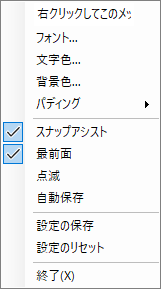

# TextDisplay

## 起動画面

## メニュー画面

### テキストボックス

メニュー画面一番上のテキストボックスに表示させたい文章を入力する。改行もできる。

### フォント

フォントダイアログウィンドウから表示させる文章のフォントを設定する。

### 文字色

色選択ダイアログウィンドウから文字色を設定する。

### 背景色

色選択ダイアログウィンドウから背景色を設定する。

### パディング

表示させる文章のパディングを設定する。数値を入力する。

### スナップアシスト

アプリを吸着させるかどうかを設定する。

### 最前面

アプリを常に最前面に表示するかどうかを設定する。

### 点滅

文字色と背景色を入れ替えて点滅させるかどうかを設定する。

### 自動保存

アプリ終了時に設定を自動保存するかどうかを設定する。

### 設定の保存

表示設定を実行ファイルのディレクトリに保存する。

### 設定のリセット

表示設定をリセットする。
